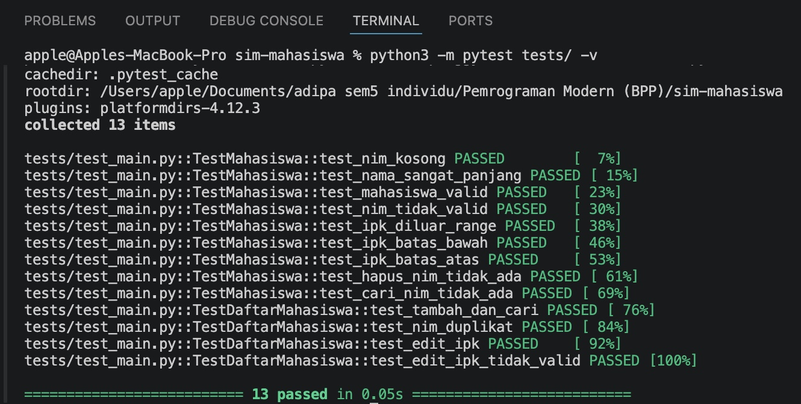
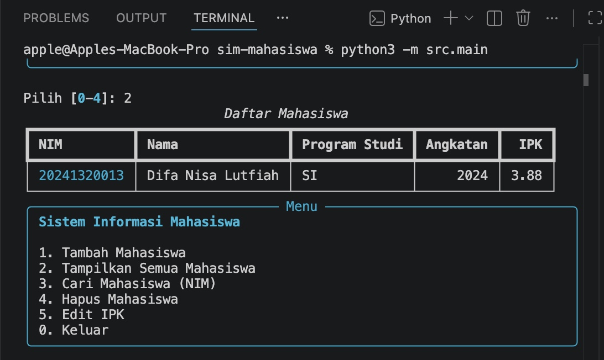

# Sistem Informasi Mahasiswa

Nama: Difa Nisa Lutfiah  
NIM: 2024130013  
Program Studi: Sistem Informasi

## Deskripsi

Sistem Informasi Mahasiswa adalah aplikasi berbasis console yang digunakan untuk mengelola data mahasiswa.

Data yang dikelola meliputi:
- NIM
- Nama
- Program Studi
- Angkatan
- IPK

## Fitur

- Tambah mahasiswa
- Tampilkan semua mahasiswa
- Cari mahasiswa berdasarkan NIM
- Hapus mahasiswa berdasarkan NIM
- Edit IPK berdasarkan NIM
- Validasi data mahasiswa
- Unit testing menggunakan pytest

## Struktur Project

```text
sim-mahasiswa/
├── src/
│   ├── __init__.py
│   ├── main.py
│   └── models.py
├── tests/
│   ├── __init__.py
│   └── test_main.py
├── docs/
├── requirements.txt
├── .gitignore
└── README.md

## Dokumentasi

### Tampilan Program



### Hasil Unit Testing

